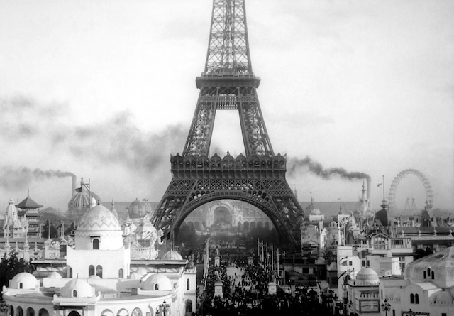
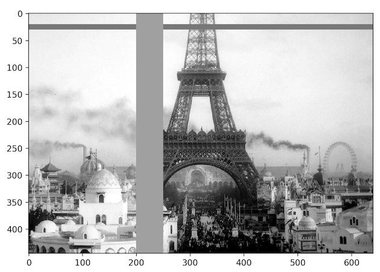
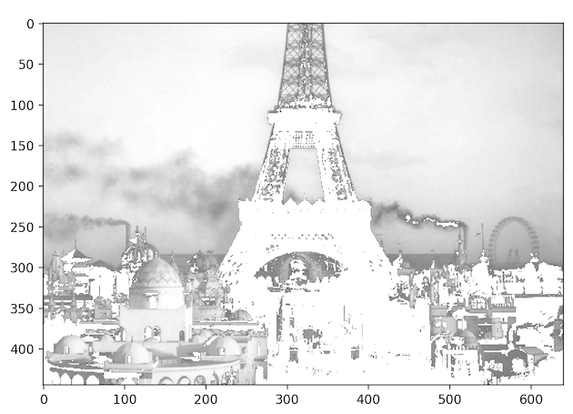
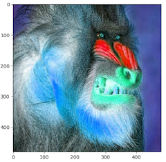

# Image Processing with python

## What and Why

- Scientific research
  - Image analysis, e.g. measuring the natural direction of grazing animals. links: [bbc](http://news.bbc.co.uk/2/hi/science/nature/7575459.stm) / [pnas](http://www.pnas.org/content/105/36/13451.full)
- Fun / Commercial
  - Image manipulation, e.g. snapchat drawing rainbow vomit. see [how to use filters](https://www.bustle.com/articles/110798-how-to-use-snapchat-lenses-so-you-can-puke-rainbows-like-everyone-else-a-step-by-step-tutorial)
- Art ...
  - Daniel Shiffman's processing examples e.g. [Voronoi](http://lecube.com/en/the-permanent-exhibition_1709)
- And other useful stuff:
  - creating thumbnails
  - analyze the color of a series of images
  - recognize shapes
  - finding faces
  - ...
	
## Installation

### Install the necessary packages

`pip install matplotlib`

`pip install scipy`

`pip install scikit-image`

### Test the installation

`ipython`

*>>>* `import skimage.io`

*>>>* `import matplotlib.pyplot`

## Getting Started with scikit-image

### Some example images

We start with two example images, one black and white `.png` and a color `.jpg` file.

-   
  _paris.png_
-   
  _mandrill.jpg_

### ipython and skimage `io` module 

Start with `ipython` in the Terminal

```python
import skimage.io as io
```

Load the image

```python
paris = io.imread('paris.png')
```

Show the image

```python
io.imshow(paris)
io.show()
```

You can also save an image with `io.imsave()`. I'll demonstrate that later.

### Getting some basic info 

Get the height and width of the image

```python
paris.shape
```
*>* `(445, 640)`

Notice that the numbers returned are the height and the width (not the other way around: `w, h` as is common elsewhere). This make more sense if you think of the pixel data as rows and columns. First the rows, then the columns.

Now let's try this with our mandrill image

```python
mandrill = io.imread('mandrill.jpg')
mandrill.shape
```
*>* `(480, 480, 3)`

This is a square image: 480 by 480 pixels. But you see that there is a third dimension: color! Mathematically this image is stored as three 2D panes on top of each other: one for red, one for green and one for blue. So for the computer this is a "table" (remember: rows and columns), but one with **three** dimensions. The interesting aspect of this is that this allows you to perform similar operations on the third dimension as on the first two.

We can get more information about the image:

the number of pixels:

```python
paris.size
```
*>* `284800`

the darkest and lightest pixels:

```python
paris.min(), paris.max()
```
*>* `(0, 255)`

or the average color:

```python
paris.mean()
``` 
*>* `177.98214185393257`

### Manipulating individual pixels

We can look at specific pixels. Again we use rows and columns as an index to access the pixels. Let's get the value of the 150th row and the 50th column:

```python
paris[150, 50]
```
*>* `226`

Or change the pixel to black:

```python
paris[150, 50] = 0
```

We can also change multiple rows of color in once:

```python
paris[20:30] = 120
```

Or multiple columns in once:

```python
paris[:, 200:250] = 160
```

Notice how a slice in multiple dimensions can be accessed: with a comma `,` separated set of colon slices `:`



And we can create a color mask, by comparing each pixel with a partical value. E.g. pixel darker than 125 (out of the 0 - 255 range).

```python
# load the image fresh again
paris = io.imread('paris.png')
# darker than 125
mask = paris < 125
# set the pixel color to white
paris[mask] = 255 
```



### Converting color images

Let's convert our color mandrill to black and white. And I'll show you how to save the image too.

```python
from skimage.color import rgb2gray
mandrill = io.imread('mandrill.jpg')
new = rgb2gray(mandrill)
io.imsave('bw-mandrill.jpg', new)
```

Check the Finder, and see the new image.

### Intermediate Example: shift the hues of an image

Finally, let's show you an intermediate example, in which we shift the hue of an image. For this we need to convert an `rgb` image to an `hsv` image (hue, saturation, brightness) as this hsv will make it easier to manipulate the colors.

```python
import skimage.io as io
# import the rgb2hsv and hsv2rgb functions
from skimage.color import rgb2hsv, hsv2rgb
mandrill = io.imread('mandrill.jpg')
# convert the rgb to hsv
hsv = rgb2hsv(mandrill)
```

A pixel in the hsv data is composed of three parts: the hue (h), saturation (s) and brightness or value (v). Each of those are in the range 0.0 - 1.0

```python
# get the pixel at row 150 and column 150
hsv[150, 150]
```
*>* `array([ 0.09562842,  0.28372093,  0.84313725])`

To shift the hue for each pixel, first we create a simple function that just does the math:

```python
def shift(hue, amount):
	hue += amount
	hue = hue % 1.0
	return hue
```

Let's test our function:

```python
y = 0.1
shift(y, 0.25)
```
*>* `0.35`

```python
y = 0.9
shift(y, 0.25)
```
*>* `0.14999999999`

So now we can use this function to manipulate all the hue values in our pixel array:

```python
hsv[:, :, 0] = shift(hsv[:, :, 0], 0.45)
```

Convert the `hsv` image back to `rgb` and display it:

```python
rgb = hsv2rgb(hsv)
io.imshow(rgb)
io.show()
```



----

## Further reading

### scikit tutorial

- https://code.tutsplus.com/tutorials/image-processing-using-python--cms-25772

### scikit-image documentation

- http://scikit-image.org/docs/dev/user_guide.html

### scientific examples

- http://scikit-image.org/docs/dev/auto_examples/index.html

### academic lecture slides / notes

- http://www.scipy-lectures.org/packages/scikit-image/
