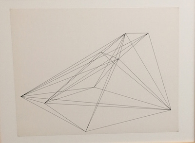
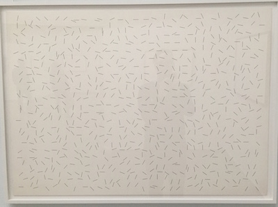
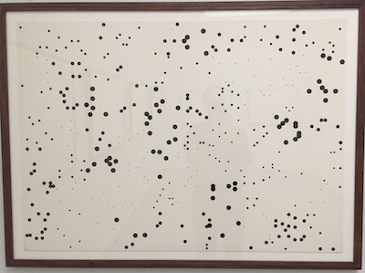

##### Department: Graphic Design

- Course: **Media Design**
- Year: 2015-2016, 2nd year
- Teacher: Dirk van Oosterbosch
- Semester: 1

### Assignment #1:
# Algorithmic Nature

## Learning Goals

Develop an understanding of algorithms and how to use them to create procedural drawings. Acquire an insight in the process of producing visuals through computer code. Being able to produce visually interesting works using procedural drawings. Collect a set of techniques that you will able to use in future works.

----

**a unified approach to grown structures**  
(by *Neri Oxman, Christoph Bader & Dominik Kolb*. from https://www.behance.net/gallery/21605971/Neri-Oxman-Wanderers)

----
## Description

Study the following 5 algorithms and create computer generated sketches and drawings using them. From each of these algorithms an example in code will be given. The assignment is to take this example and experiment with it further, creating unique and interesting drawings / sketches.

#### These are the five algorithms

- fibonacci
- perlin noise
- recursion
- L-systems
- *flocking (if time permits)*

*(ordered from simple to advanced)*

#### Limitations

To make the assignment a little more interesting and concrete, these are the limitation the drawings or sketches should adhere to:

- the canvas of the drawings are square (dimension should not matter if you use vectors, but you'll have to export an image (or thumbnail image) of 200 x 200 pixels)
- only use black and white and greyscales
- (take a model from nature as inspiration)
- the drawings must be procedural, meaning a computer renders them based on your rules
- you must code the drawings your self
- use python as programing language
- publish source code and results on gitHub

----

**Random drawings (toevalstekeningen)**  
(by *Herman de Vries*, 1971-1972, [Kröller-Müller Museum](http://krollermuller.nl/herman-de-vries-toevalstekeningen))

----
## Planning

##### Week 1:
*September 3rd 2015*

- Introduction to the Media Design course.
- Introduction to the assignment.

**Homework:**

- Create an account on GitHub, let me and your class know your account handle and accept the invitation to the shared repository.
- Download and install the [software](Software.md)
- Create a journal, notebook or blog about your research.
 	1. Document your programming efforts, ideas and sketches
	2. Collect frustrations with digital tools
- Visit a botanic garden or zoo for inspiration.
- Watch Vi-Heart's video about Spongebob (see [literature](#literature))

##### Week 2:
*September 10th 2015*

- Fibonacci

**Homework:**

- Create multiple "sketches" (or drawings) with PlotDevice, using the _Fibonacci_ algorithm.
- Read / Follow / Study the PlotDevice tutorial, especially:
	- chapter 3 - [Primitives](http://plotdevice.io/tut/Primitives) 	 
	- chapter 6 - [Geometry](http://plotdevice.io/tut/Geometry)
	

##### Week 3:
*September 17th 2015*  
*- Lessons are canceled -*

**Homework:**

- CODE:
	- Extend the previous homework: create at least **6  sketches** (procedural drawings made with PlotDevice)
	- Export these 6 sketches as a *200 x 200* pixel `.png` file
	- Read / Follow / Study the PlotDevice tutorial, specifically:
		- chapter 9: [Variables](http://plotdevice.io/tut/Variables.html)
		- chapter 13: [Repetition](http://plotdevice.io/tut/Repetition.html)
- GIT:
	- Make sure that your GitHub account has your **full name** and an **avatar** image. (for those who haven't done that yet)
	- Accept the invitation to the *ArtezGDA Students* team on GitHub. (for those who haven't done that yet)
	- Test your access to the *Algorithmic-Nature* repository by editing a page on the [wiki](https://github.com/ArtezGDA/Algorithmic-Nature/wiki) 
	- Install git on your laptop (follow the [guide](https://help.github.com/articles/set-up-git/) on GitHub)
	- Read two beginners guides to **git** (both conveniently called *Git for Designers*):
		- Read the (short) introduction at [treehouse](http://blog.teamtreehouse.com/git-for-designers-part-1) (from the top to *Step 1: Install and Configure Git* )
		- Follow the tutorial from [tutsplus](http://code.tutsplus.com/tutorials/git-for-designers--pre-54689) (from '*The Basic Cycle*' to '*Ignoring Files*'). This will teach you:
			- `git init`
			- `git status`
			- `git add`
			- `git commit`
			- `git log`
			- `git revert`
			- `git branch`
			- `git checkout`
			- `git merge`
	

##### Week 4:
*September 24th 2015*

- Working with git
- Rotation and nested for loops (see [extra_01_rotation_matrix.pv](https://github.com/ArtezGDA/Algorithmic-Nature/blob/master/Fibonacci/extra_01_rotation_matrix.pv))
- Building a Fibonacci spiral (see [07_fibonacci_spiral.pv](https://github.com/ArtezGDA/Algorithmic-Nature/blob/master/Fibonacci/07_fibonacci_spiral.pv))

**Homework:**

- Study the examples demonstrated in class (see the two examples above)
- Create 5 new sketches based on `random` (and on `for` loops, and possible `if`'s). See the random example [01_random_dots.pv](https://github.com/ArtezGDA/Algorithmic-Nature/blob/master/PerlinNoise/01_random_dots.pv).
- Install the python package called '*noise*':
	- `sudo easy_install noise`
	- Make sure the last line says: "*Finished processing dependencies for noise*"
- Make sure your github account is fully annotated (with full name and personal avatar)
- Add the code for your sketches and exported 200x200 pixel png images to your folder on github (in the Algorithmic-Nature repository)
- Edit the `.md` file with your name (in the root of the Algorithmic-Nature repository):
	- Add the (at least 10) exported images to that `.md` file, so they are visible when you browse github.
	- Add a link to the source code of each sketch.
	- (Have a look at this .e.g. readme of how that's done)

##### Week 5:
*October 1st 2015*

- Perlin Noise

**Homework:**

- Create 5 new sketches based on Perlin Noise
- Sync all work to GitHub and update your `.md` file accordingly
- Read chapter 14: [Commands](http://plotdevice.io/tut/Commands)

##### Week 6:
*October 8th 2015*

- Recursive functions

**Homework:**

- Create 5 new sketches based on Recursive Functions
- Sync all work to GitHub and update your `.md` file accordingly

##### Week 7:
*October 15th 2015*

- Evaluation. (One-on-one evaluation)

##### Autumn Holliday:
*No classes*

##### Week 8:
*Monday 26th of October  2015*

- **Final deadline of this assignment**:
	- Fully fledged GitHub account, personal overview `.md` page in the [*Algorithmic-Nature*](https://github.com/ArtezGDA/Algorithmic-Nature) repository and uploaded 20 of the following sketches:
	- 5 sketches using Fibonacci
	- 5 sketches using Random
	- 5 sketches using Perlin Noise
	- 5 sketches using Recursive Functions
	
The grade for this assignment will be composed from the quality of these 5 subtasks:

- A: on-time, original, sufficient, according to the specs: 2 points
- B: almost perfect: 1 points
- C: insufficient or missing: 0 points

(So it's relatively easy to get a grade A. 2 + 2 + 2 + 2 + 2 = 10 points :-)

## Evaluation

Criteria for judging the work:

- The **creative process**,
- the digital process and **workflow** of creating procedural drawings,
- **insight** in the algorithmic aspects of nature,
- acquired **coding skills** and
- the **expressive qualities** within the limitation of the assigment.

----

**Substrate**  
(by *Jared Tarbell*, 2003, [www.complexification.net](http://www.complexification.net/gallery/machines/substrate/))

----
## Literature

##### Fibonacci
- [Vi Heart - SpongeBob's Pineapple (video)](https://www.youtube.com/watch?v=gBxeju8dMho)

##### L-systems
- [The Algorithmic Beauty of Plants](http://algorithmicbotany.org/papers/abop/abop.pdf) (Mathematic Scientific Paper)

##### Nature + Code

- [**Hello World!**](http://hello-world.cc/?page_id=16) (Documentary 2013) ([Watch on Vimeo](https://vimeo.com/60735314))
- [**Nature of Code** - Vimeo Video channel by *Daniel Shiffman*](https://vimeo.com/channels/natureofcode)

##### Inspiration

- [**How algorithms shape our world** - *Kevin Slavin*](http://www.ted.com/talks/kevin_slavin_how_algorithms_shape_our_world?language=en) (TED Talk, 2011)
- [Blurry-paths Tumbler Blog](http://www.blurrypaths.com/tagged/coding)

##### Coding

- [PlotDevice Tutorial](http://plotdevice.io/tut/)

##### Git

- Treehouse's [Git for Designers](http://blog.teamtreehouse.com/git-for-designers-part-1) article
- Tutsplus' [Git for Designers](http://code.tutsplus.com/tutorials/git-for-designers--pre-54689) tutorial
