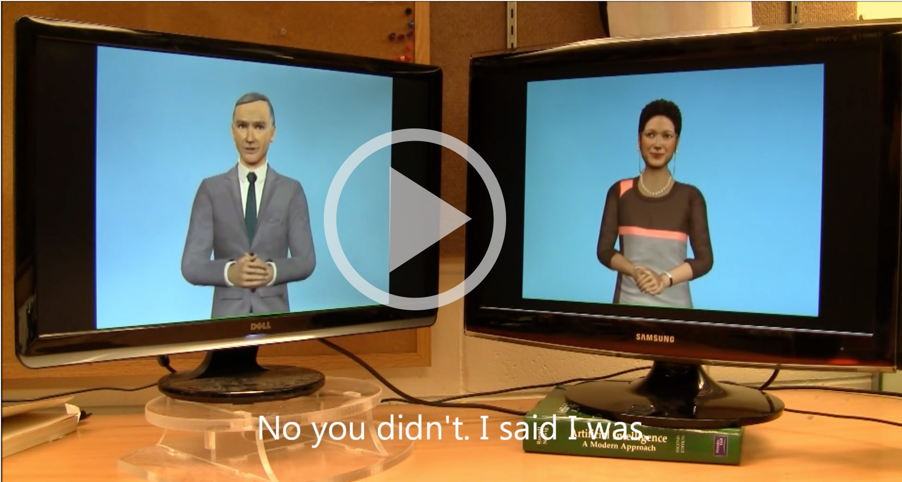

#####Department: Graphic Design

- Course: **Media Design**
- Year: 2016-2017, 2nd year
- Teachers: Dirk van Oosterbosch & Coralie Vogelaar
- Semester: 1

###Assignment #2:
#Design a Chatbot
## _A Text Adventure_

Where a robot used to be programmed by filling in an elaborate if .. , then..  flow chart where every detail had to be written out, nowadays robots learn by themselves by giving them a certain dataset of information. So to learn a robot to recognise an image of a cat, we don’t have to describe all the feature of the cat to the bot, but give the bot a large database of images of a cat. 

The first chat bot that used this tactic called deep learning, was http://www.cleverbot.com which started out in 1997. Cleverbot’s responses are also not programmed. Instead, it “learns” from human input; Humans type into the box and the system finds all keywords or an exact phrase matching that input. After searching through its saved conversations, it responds to the input by finding how a human responded to that input when it was asked, in part or in full, by Cleverbot. It is also good to know that every search query you make on google is exactly feeding a neural network to make google smarter.

For this assignment we want you to design a chat bot. We of course don’t expect you to make a deep learning bot, or a believable human being. But we expect you to be inspired by different databases that can feed your bot, like youtube comments, wikipedia wisdoms etc. but can also be another chatbot. In the end even the clunkiest computer chat program can open a little window on human behaviour or introspection.

##Inspiratie

https://www.youtube.com/watch?v=LY7x2Ihqjmc (images/still_sunspring.jpg)

@DeReactiegraaf - a twitterbot that tweets the reactions written below articles of right wing populistic newspaper 'De telegraaf'

##Learning Goals

##Description

##Planning

#####Week 1:
*November 8th 2016*

**Lesson 1: Introduction**

- something

**Homework:**

- Formulate your concept.

#####Week 2:
*November 15th 2016*

**Lesson 2: ...**

- something

**Homework:**

- something else

#####Week 3:
*November 22nd 2016*

**Lesson 3: ...**

- something

**Homework:**

- something else

#####Week 4:
*November 29th 2016*

**Lesson 4: ...**

- something

**Homework:**

- something else

#####Week 5:
*December 6th 2016*

**Lesson 5: ...**

- something

**Homework:**

- something else

#####Week 6:
*December 13th 2016*

- Evaluation

##Evaluation

##Literature

####Reading

####Listening

- [Radio Lab - Talking to Machines ](http://www.radiolab.org/story/137407-talking-to-machines/)
- [Good Point (Rafaël Rozendaal & Jeremy Bailey) - AI](http://www.stitcher.com/podcast/rafael-rozendaal/good-point/e/03-artificial-intelligence-48090727)

####Video's

####Inspiration

