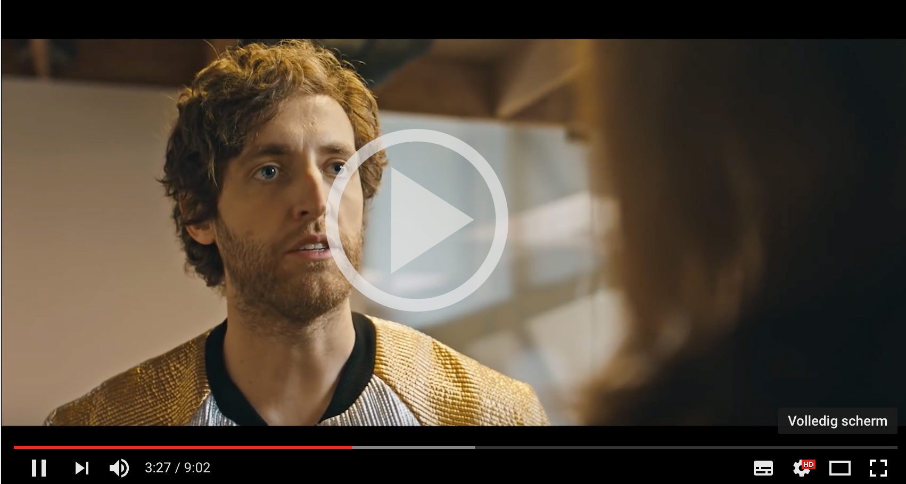

#####Department: Graphic Design

- Course: **Media Design**
- Year: 2016-2017, 2nd year
- Teachers: Dirk van Oosterbosch & Coralie Vogelaar
- Semester: 1

###Assignment #2:
#Design a Chatbot
## _A Text Adventure_

Where a robot used to be programmed by filling in an elaborate if .. , then..  flow chart where every detail had to be written out, nowadays robots learn by themselves by giving them a certain dataset of information. So to learn a robot to recognise an image of a cat, we don’t have to describe all the feature of the cat to the bot, but give the bot a large database of images of a cat. 

The first chat bot that used this tactic (called deep learning), was http://www.cleverbot.com which started out in 1997. Cleverbot’s responses are not written out. Instead, it “learns” from human input; Humans type into the box and the system finds all keywords or an exact phrase matching that input. After searching through its saved conversations, it responds to the input by finding how a human responded to that input when it was asked, in part or in full, by Cleverbot. It is also good to know that every search query you make on google is exactly feeding a neural network to make google smarter.

For this assignment we want you to design a chat bot. We of course don’t expect you to make a deep learning bot, or a believable human being. But we expect you to be inspired by different databases that can feed your bot, like youtube comments, wikipedia wisdoms etc. but can also be another chatbot. In the end even the clunkiest computer chat program can open a little window on human behaviour or introspection on our own behaviour or thinking patterns.

##Inspiratie

#### Movies

_Cleverbots talking to each other_

----

_First movie written by an AI. Sunspring by Oscar Sharp, Ross Goodwin_

#### Podcasts

- [Radio Lab - Talking to Machines ](http://www.radiolab.org/story/137407-talking-to-machines/)
- [Good Point (Rafaël Rozendaal & Jeremy Bailey) - AI](http://www.stitcher.com/podcast/rafael-rozendaal/good-point/e/03-artificial-intelligence-48090727)

#### Examples of Twitter bots

- [@DeReactiegraaf](https://twitter.com/dereactiegraaf) - a twitterbot that tweets the reactions written below articles of right wing populistic newspaper 'De telegraaf'
- **Arguetron** bot to bait right wing twitter trolls [via BoingBoing](https://boingboing.net/2016/10/10/alt-right-trolls-argue-for-hou.html)[via the Verge](http://www.theverge.com/2016/10/7/13202794/arguetron-twitter-bot-alt-right-internet-bigots-4chan-sarah-nyberg)
- Microsoft's **Tay** bot goes wrong [via the Verge](http://www.theverge.com/2016/3/24/11297050/tay-microsoft-chatbot-racist)

#### Theory about *Conversational Interfaces*

- https://www.fastcodesign.com/3058546/conversational-interfaces-explained
- Talk by Alper Cugun: (Conversations are the new Interfaces (Vimeo))[https://vimeo.com/159756392]

#### Historic Examples

- [**Eliza**, computer therapist](http://www.manifestation.com/neurotoys/eliza.php3)
- a game genre: the **Text Adventure**
- **Allo**, Google's new message app and bot
- [**WeChat** example: chat as universal interface](http://dangrover.com/blog/2014/12/01/chinese-mobile-app-ui-trends.html#chatasui)

##Learning Goals

##Planning

#####Week 1:
*November 8th 2016*

**Lesson 1: Introduction**

- introduction assignment
- formulate your first ideas 

**Homework:**

- Formulate your concept. Give a couple of sentences of an possible conversation scenario.

#####Week 2:
*November 15th 2016*

**Lesson 2: Terminal**

- Terminal and the shell:
	- Install zsh, dotfiles and alt key: follow [zsh dotfiles repo](https://github.com/irlabs/zsh-dotfiles)'s guide
	- The lesson follows the [ZSH cheat sheet](Lesson_03_zsh.md)

- reflection on your idea in the group / small groups

**Homework:**

- Excersizes with the Terminal

#####Week 3:
*November 22nd 2016*

**Lesson 3: Writing a chatbot in python**

- Chatbot structure
- Random responses
- Trigger on keywords
- Global state
- Installing and using the chatterbot module

**Homework:**

#####Week 4:
*November 29th 2016*

**Lesson 4: AI & the Markov Chain**

- Deep Learning
- Markov Chain

- The lesson about **Regular Expressions** will be postponed until 2017

**Homework:**

- ...

#####Week 5:
*December 6th 2016*

**Lesson 5: Demo & Presentation**

- Exhibition of your chatbots.

**Homework:**

- ...

#####Week 6:
*December 13th 2016*

**Evaluation**

