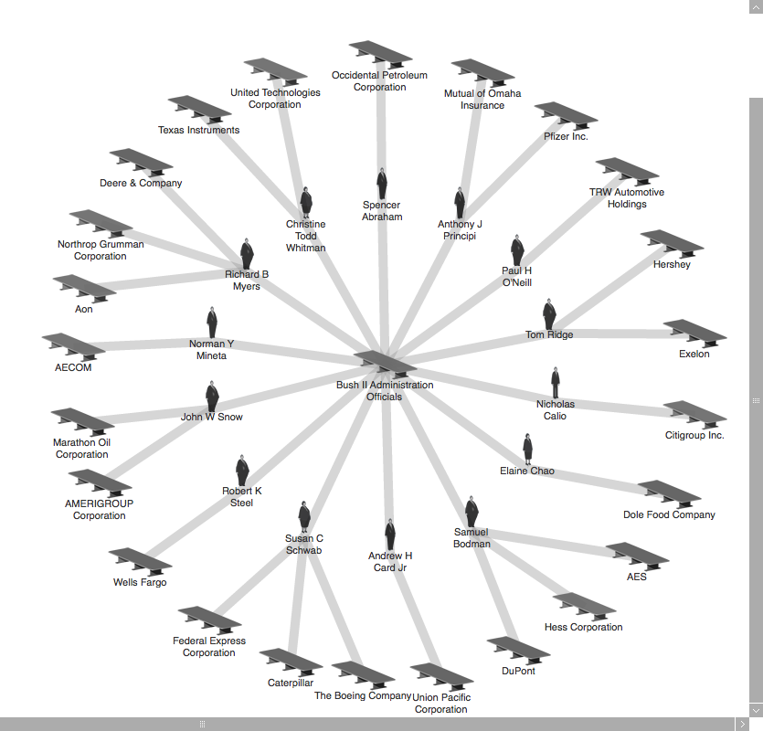
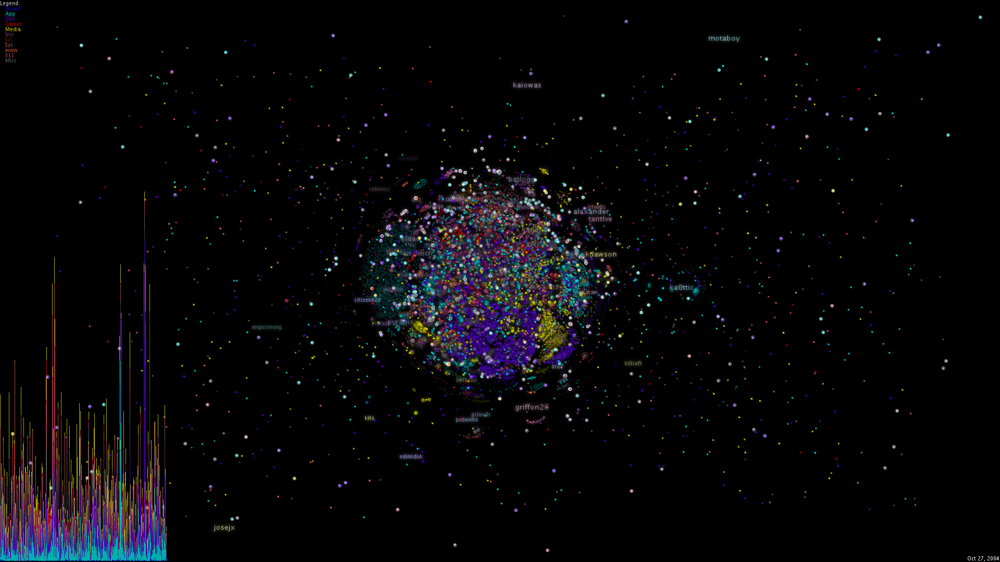

#####Department: Graphic Design

- Course: **Media Design**
- Year: 2015-2016, 2nd year
- Teacher: Dirk van Oosterbosch
- Semester: 2

###Assignment #4:
#Mapping the City

##### [Shared Data Repository: MappingTheCity-Data](https://github.com/ArtezGDA/MappingTheCity-Data)
##### [Design Work Repository: MappingTheCity-Maps](https://github.com/ArtezGDA/MappingTheCity-Maps)

## Introduction

For decades there is a global shift going of people moving from rural to urban areas. The same can be said of (digital) information. Cities are a concentration of vast quantaties of ever increasing data. This assigment is about getting a grasp on these vast amounts of data, and being able to use this data to perform research and to tell meaningfull stories and demonstrate analytical insights.

##Description

*Diagram showing the process of scraping and visualizing (from Visualizing Data, O'Reilly)*

- Do research. Find data sources. 
- From the data develop your own opinion, stance and vision on cities, agglomerations and urbanization.
- Select a rich data source with [points in time | geographical locations | network of connections] to illustrate your point.
- Parse this data, filter it, mine it, scrape additional data, combine it and refine it, while documenting your process as open source on github.
- Design a poster that plots out the data as representational map of your story.
- Iterate the poster three times.

The assignment is a two part assignment:

- Collaborative Group assigment:
	- Group of maximum 3 people (team up coders with non-coders)
	- Collection and Grooming of the data
	- Store in [Shared Data Repository](https://github.com/ArtezGDA/MappingTheCity-Data)
- Individual assignment:
	- Constructing your own story and designing the poster
	- Store in [Design Work Repository](https://github.com/ArtezGDA/MappingTheCity-Maps)

----
##Learning Goals

Acquire a fluency into working with big data research and creating information graphics. Articulate a vision or insight about cities and urbanization. Familiarize yourself with the process of creating a meaningful and readable map from structured data. Being able to independently create a concept, draft and multiple iterations of a research based map or poster.

----
##Planning

python: ipython, csv, xml, json & svg
javascript: paper.js, D3.js
FIRST DRAFT
regex
python: map, reduce
python: database (sqlite) & django
SECOND DRAFT
javascript: TileMill / MapBox / Modest Maps
javascript: Illustrator Scripting git
graphiz & dot

#####Week 1:
*March 24th 2016*

- Introduction to the **Mapping the City** assignment
- Formation of teams for the collaborative part of the assignment

**Homework:**

- Pick topic & Find data sources
- Team work to research and select the best data sources
- Investigate the data
- Make an analysis of its structure and properties

#####Week 2:
*March 31st 2016*

- Lecture: from scraping to poster

**Homework:**

- Scrape the data from the sources.
- Create and groom one or more `.json` files.
- Document the purpose, contents, structure, and attributes of your `.json` files.
- Make open source:
	- the source data (or link to live data)
	- your analysis of the data
	- your methods and tools to scrape and groom the data
	- the structured .json files

#####Week 3:
*April 7th 2016*

- Group Presentation of the found and groomed data
- Plenary Discussion
- Collaborative organization and categorization of the data
- Demonstration of some simple techniques to visualize the data 

**Homework:**

- Create the first iteration of the poster

#####Week 4:
*April 14th 2016*

- Group presentation of the first iteration of the poster
- ...

**Homework:**

- ...

#####Week 5:
*April 21st 2016*

- ...

**Homework:**

- ...

#####Week 6:
*April 28th 2016*

- ...

**Homework:**

- Finalizing the second iteration of the poster

##### Ascension Day

#####Week 7:
*May 12th 2016*

- Group presentation of the second iteration of the poster

**Homework:**

- ...

#####Week 8:
*May 19th 2016*

- ...

**Homework:**

- ...

#####Week 9:
*May 26th 2016*

- ...

**Homework:**

- Create the final iteration of the poster

#####Week 10:
*June 2nd 2016*

- Group Presentation of the final poster (and previous iterations)
- Celebrations

#####Week 11:
*June 9th 2016*

- Evaluation

##Evaluation

Group Presentation & Plenary discussion
Criteria for judging the work:
Process, Structure, Insight, Coding Skills, Persuasiveness and relevance, Truthfulness, Open Source, Quantity of the Data (see below) and Communicating Quality of the Design and Presentation.
Finally, to make sure the poster is coded (and not drawn by hand), there is a formal criteria on the quantity of data:
The data source (and consequently the poster) should contain at least
>100 relations / links / connections,
> 250 locations on a map,
> 500 points in time,
or a combination of two or three of the above

----

### Examples of Data Visualization Maps

  
*War Marches by Hannibal and Napolean*

  
*Origin of Species - Ben Fry*

  

  
*They Rule*

  

*Dutch buildings by year of construction([http://code.waag.org/buildings/](http://code.waag.org/buildings/))*

----

##Literature

#### Movies:

- Media For Thinking The Unthinkable
	 - Bret Victor [video talk & lecture notes](http://worrydream.com/#!/MediaForThinkingTheUnthinkable) (40 min, 2013)

#### Books:

- **The Visual Display of Quantitative Information**
	- *Edward R. Tufte* (Graphics Press, 1992)
- **Envisioning Information**
	- *Edward R. Tufte* (Graphics Press, 1990)
- **Beautiful Evidence**
	- *Edward R. Tufte* (Graphics Press, 2006)
- **Visual Explanations**: Images and Quantities, Evidence and Narrative
	- *Edward R. Tufte* (Graphics Press, 1997)
- **Now You See It**: Simple Visualization Techniques for Quantitative Analysis
	- *Stephen Few* (Analytics Press, 2009)
- **Show Me the Numbers**: Designing Tables and Graphs to Enlighten
	- *Stephen Few* (Analytics Press, 2012)
- **Form+Code** in Design, Art, and Architecture (Design Briefs)
	- *Casey Reas* (Princeton Architectural Press, 2010)
- **The Book of Trees**: Visualizing Branches of Knowledge
	- *Manuel Lima* (Princeton Architectural Press, 2014)
- **Visual Complexity**: Mapping Patterns of Information
	- *Manuel Lima* (Princeton Architectural Press, 2011)
- **Visualize This**: The FlowingData Guide to Design, Visualization, and Statistics
	- *Nathan Yau* (Wiley, 2011)
- **Visual Insights**: A Practical Guide to Making Sence  of Data
	- *Katy Bömer & David E. Polley* (MIT Press, 2014)
- **Beautiful Visualization**: Looking at Data through the Eyes of Experts (Theory in Practice)
	- *Julie Steele* (O'Reilly Media, 2010)
- **Data Flow**: Visualising Information in Graphic Design
	- Robert Klanten (Die Gestalten Verlag, 2008)
- **Data Flow 2**: Visualizing Information in Graphic Design
	- Robert Klanten (Die Gestalten Verlag, 2010)
- **Generative Design**: Visualize, Program, and Create with Processing
	- *Hartmut Bohnacker* (Princeton Architectural Press, 2012) 
- **Knowledge Is Beautiful**: Impossible Ideas, Invisible Patterns, Hidden Connections--Visualized
	- *David McCandless* (Harper Design, 2014)

#### Websites:
- Information Aesthetics
	- [infosthetics.com](http://infosthetics.com)
- Visual Complexity
	- [visualcomplexity.com](http://www.visualcomplexity.com/vc/)
- The Design of Information
	- [blog.threestory.com](http://blog.threestory.com)
	
##### Extra:	
- List of possible tools
	- [list of design tools](http://www.creativebloq.com/design-tools/data-visualization-712402)
